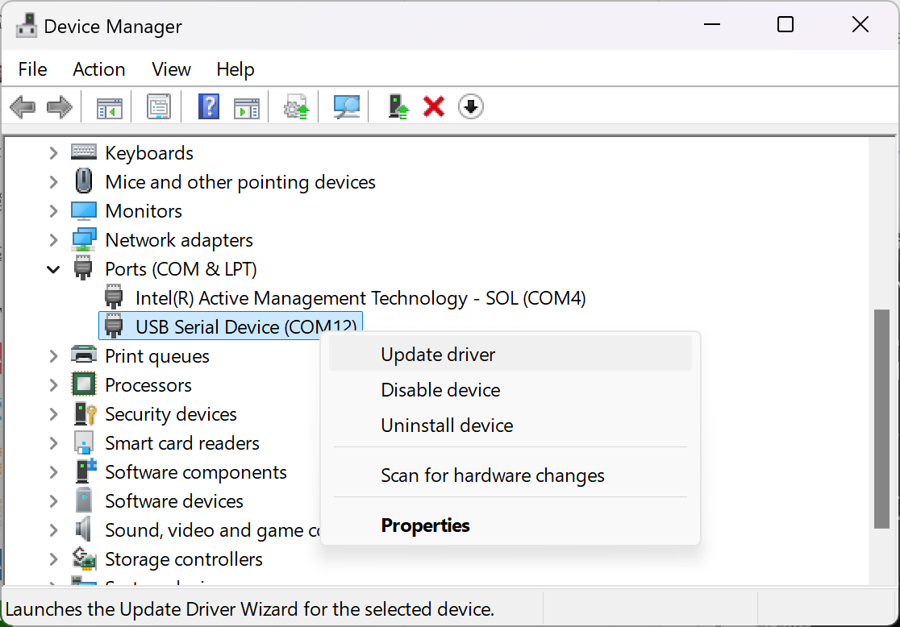

# RNDIS for Windows 10/11

If your WLAN Pi shows up as a COM port (serial device) instead of a network adapter on your Windows 10 or Windows 11 host, follow these steps.

1. Download the [RNDIS driver](https://github.com/WLAN-Pi/drivers/raw/refs/heads/main/RNDIS.zip).

2. Extract the RNDIS driver and note where you extracted the files.

3. Open Device Manager and locate the **Ports (COM & LPT)** section. If multiple devices are listed and you're unsure which one corresponds to the WLAN Pi, observe the Device Manager while unplugging and reconnecting the WLAN Pi. The correct device will disappear and reappear in the list identifying the respective COM port to update the driver for.

4. Select **Browse my computer for drivers**

5. Provide the PATH to the location where you extracted the driver files from step 2.

6. Click **Next**.

7. Confirm you see the WLAN Pi showing as a **USB Ethernet/RNDIS Gadget**.

